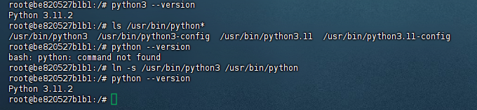
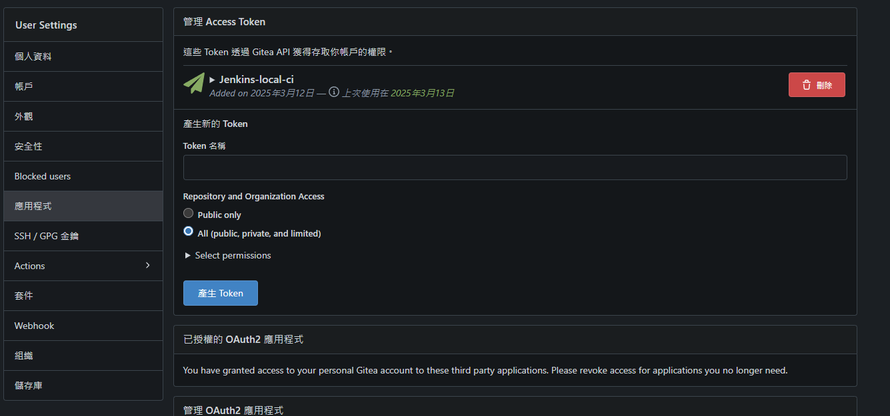
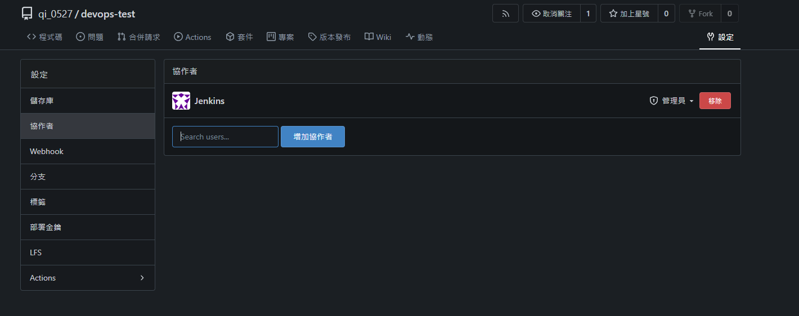
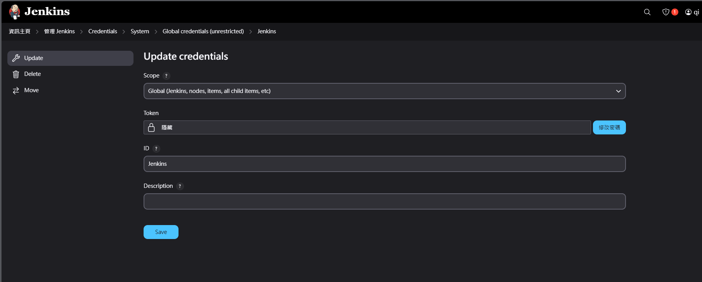
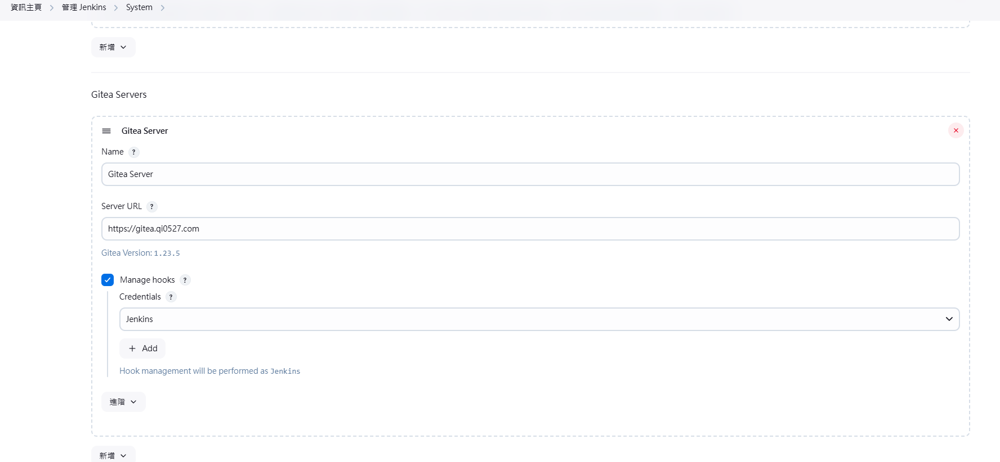
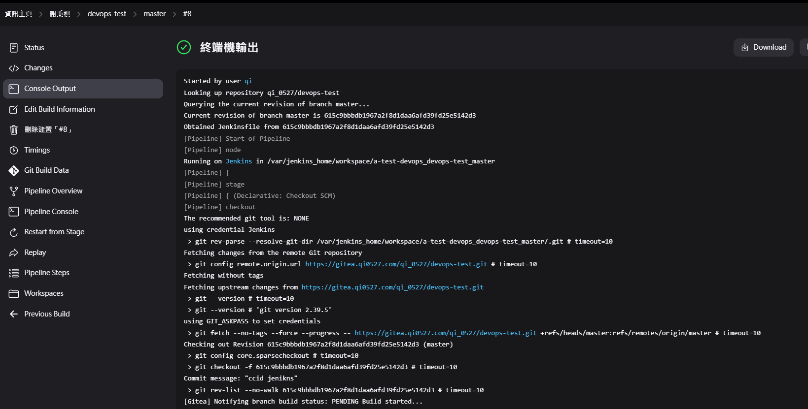
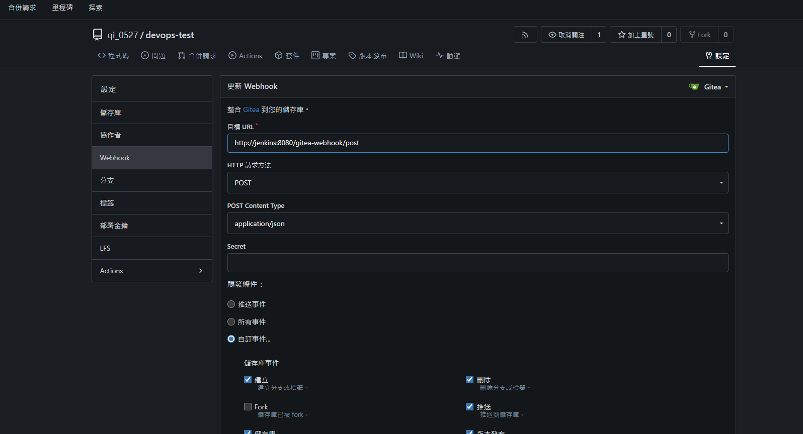
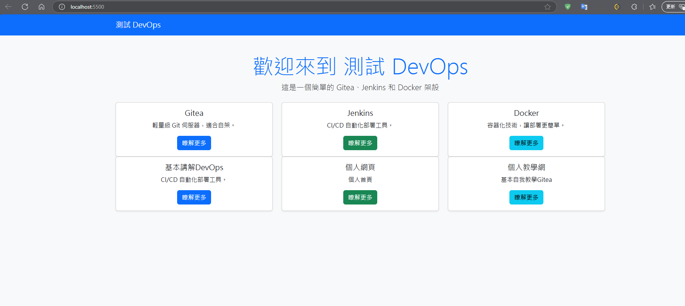

# Jenkins 與Gitea CICD 教學

## 簡介
Jenkins 是一款開源的自動化工具，主要用於 持續整合（CI） 和 持續部署（CD）。它支援多種建置工具（如 Maven、Gradle）、版本控制系統（如 Git、SVN），並可透過插件擴展功能，整合 Docker、Kubernetes、Slack 等工具。Jenkins 可運行於 Windows、Linux、Docker 等環境，並採用 Master-Agent 架構 來提高效能與可擴展性。你已經在 Docker 內架設 Jenkins，這有助於環境隔離、版本管理及部署靈活性。 

## 主要學習
1. 安裝Jenkins
2. 拉取Gitea 專案 讓Jenkins整合 (CI)
3. 將Gitea 專案 經由Jenkins測試專案後自動部署Docker (CD)

## 基礎安裝Jenkins
1. 建立資料夾DevOps在創建資料夾Jenkins (DevOps/Jenkins)
2. 再Jenkins資料夾下創建 docker-compose.yml
```
services:
  jenkins:
    image: jenkins/jenkins:lts
    container_name: jenkins
    restart: always
    ports:
      - "8080:8080"
      - "50000:50000"
    volumes:
      - ~/jenkins_home:/var/jenkins_home
      - /var/run/docker.sock:/var/run/docker.sock  # 允許容器訪問主機的 Docker 守護進程
      - /usr/local/bin/docker:/usr/local/bin/docker  # 確保 Docker 客戶端在容器中可用
    user: root  # 這裡將 Jenkins 容器運行的用戶設置為 root，方便安裝 Docker 客戶端

```
3. 輸入 docker-compose up -d 就安裝完成
4. 訪問 http://localhost:8080/ ，可以看到 Jenkins 已啟動，並顯示需要輸入密碼解鎖。

 進入 Jenkins 容器
```
docker exec -it jenkins bash
```
查詢密碼
```
cat /var/jenkins_home/secrets/initialAdminPassword
```


5. 選擇推薦安裝的
6. 輸入用戶名跟密碼
7. 再來記得都是localhost:8080確定沒問題就可以完成了
8. 下载插件在系统管理—插件管理的Available plugins
```
Locale        （中文插件）

Gitlab Plugin （拉取 gitlab 中的源代码）

Maven Integration（mavene 構建工具）

Publish Over SSH（推送工具）

Role-based Authorization Strategy（權限管理）

Deploy to container（自动化部署工程所需要插件，部署到容器插件）

git parameter（用户參數化構建過程添加git類型參數）

Docker Plugin 

Docker Pipeline

Gitea (3個都安裝)
            
```

9. 安裝Python 
進入jenkins容器
```
docker exec -it jenkins bash
```
先確定是否有docker CLI
```
docker ps

```
沒有就要安裝
```
apt-get update
apt-get install -y docker.io

```

安裝Python 
```
apt update && apt install -y python3 python3-venv python3-pip
```
查看python 版本
```
python3 --version
```
或者看所有版本
```
ls /usr/bin/python*

python3 --version
python3.11 --version
python3.9 --version

```
如果你的系統沒有 python 指令，你可以手動建立一個符號連結，讓 python 指向 python3：
```
ln -s /usr/bin/python3 /usr/bin/python

python --version

```


## 設定Gitea 
1. 在 Gitea 註冊使用者 Jenkins，同時為使用者 Jenkins 添加 API 存取權杖（Access Token），用於Jenkins 從 Gitea 拉取程式碼。  



2. 在 Gitea 中建立組織我是原帳號qi_0527，並將 Jenkins 使用者添加為 組織管理員或者在儲存庫 devops-test下加入協作者Jenkins(管理員)。  



3. 在qi_0527 組織中建立程式碼儲存庫 devops-test。  
4. 修改 Gitea 伺服器的 Webhook 設定，確保 Jenkins 可以接收 Gitea 的 Push 事件並自動觸發 CI/CD 任務 (正常Jenkins有勾Manage hooks會自動創建)。

## Jenkins 
1. 打開 Jenkins 的「Manage Credentials」（管理憑證），新增 Gitea 存取權杖（Access Token），用於從 Gitea 拉取程式碼，以及透過 API 安裝 Webhook。  
2. 選擇 Kind（類型）： `Gitea Personal Access Token`。  
3. 選擇 Scope（範圍）：`Global`（全域）。  
4. 在 Token 欄位填入從 Gitea 申請的存取權杖（Access Token）。  
5. 儲存憑證，並確保 Jenkins 可以成功存取 Gitea。



6. 設定Gitea資料連線 找到 Gitea Server (Manage hooks 一定要打勾)



## Gitea 專案上傳
1. 可以用我的test-python.zip
2. 重點是Jenkinsfile跟Dockerfile
3. Jenkinsfile(本專案是用python所以有寫自動創建虛擬機venv)
```
pipeline {
    agent any

    environment {
        WORKSPACE = '/var/jenkins_home/workspace/devops-test-pipeline'
        PROJECT_DIR = "${WORKSPACE}/devops-test"
        VENV_DIR = "${PROJECT_DIR}/venv"
        IMAGE_NAME = 'devops-test-image'
        CONTAINER_NAME = 'devops-test-container'
    }

    stages {
        stage('檢查工作目錄') {
            steps {
                script {
                    echo "=== 檢查工作目錄 ==="
                    echo "當前目錄: ${pwd()}"
                }
            }
        }

        stage('檢查 Python 版本') {
            steps {
                script {
                    echo "=== 檢查 Python 版本 ==="
                    sh 'python3 --version || { echo "Python3 未安裝，請確認系統環境！"; exit 1; }'
                }
            }
        }

        stage('安裝 pip') {
            steps {
                script {
                    echo "=== 安裝 pip ==="
                    sh 'apt-get update && apt-get install -y python3-pip'
                }
            }
        }

        stage('拉取或更新專案') {
            steps {
                script {
                    echo "=== 檢查是否已經存在專案目錄 ==="
                    if (!fileExists("${PROJECT_DIR}")) {
                        echo "專案目錄不存在，正在拉取專案..."
                        sh "git clone https://gitea.qi0527.com/qi_0527/devops-test.git ${PROJECT_DIR}"
                    } else {
                        echo "專案目錄已存在，正在更新..."
                        dir("${PROJECT_DIR}") {
                            sh 'git pull'
                        }
                    }
                }
            }
        }

        stage('設定 Python 虛擬環境') {
            steps {
                script {
                    echo "=== 設定 Python 虛擬環境 ==="
                    if (!fileExists("${VENV_DIR}")) {
                        echo "創建虛擬環境..."
                        sh "python3 -m venv ${VENV_DIR}"
                    } else {
                        echo "虛擬環境已存在，將重新啟動"
                    }
                    // 啟動虛擬環境
                    sh ". ${VENV_DIR}/bin/activate"
                }
            }
        }

        stage('安裝依賴') {
            steps {
                script {
                    echo "=== 安裝依賴 ==="
                    // 確保在虛擬環境中執行
                    sh ". ${VENV_DIR}/bin/activate && pip install --upgrade pip"
                    sh ". ${VENV_DIR}/bin/activate && pip install -r ${PROJECT_DIR}/requirements.txt"
                }
            }
        }

        stage('構建 Docker 映像') {
            steps {
                script {
                    echo "=== 構建 Docker 映像 ==="
                    sh "docker build -t ${IMAGE_NAME} ${PROJECT_DIR}"
                }
            }
        }

        stage('停止並移除舊容器') {
            steps {
                script {
                    echo "=== 停止並移除舊的容器 ==="
                    sh "docker stop ${CONTAINER_NAME} || true"
                    sh "docker rm ${CONTAINER_NAME} || true"
                }
            }
        }

        stage('啟動 Docker 容器') {
            steps {
                script {
                    echo "=== 啟動 Docker 容器 ==="
                    sh "docker run -d --name ${CONTAINER_NAME} -p 5500:5500 ${IMAGE_NAME}"
                }
            }
        }

        stage('部署完成') {
            steps {
                echo "=== 部署完成 ==="
            }
        }
    }
}

```
4. Dockerfile (docker架設)
```
# 使用官方 Python 3.11 作為基礎映像
FROM python:3.11-slim

# 設定工作目錄
WORKDIR /app

# 複製 requirements.txt 並安裝依賴
COPY requirements.txt .
RUN pip install --no-cache-dir -r requirements.txt

# 複製應用程式檔案
COPY . .

# 設定 Flask 應用程式的執行命令
CMD ["python", "app.py"]

```
5. 以上是會自動部署到docker 5500 端口  

## 開始創建任務自動化 CICD 
1. 進入主頁面點擊「新建任務」。  。  
3. 輸入名稱（例如：`qi_0527`），並選擇「Organization Folder」（組織資料夾）。  
5. 再 Projects   Repository Sources 
6. 選擇 Gitea Server
7. Credentials : Jenkins
8. Owner : qi_0527 (組織)(不是儲存庫,Jenkins會依據儲存庫的Jenkinsfile自動判斷)
9. 這樣就好了,按下Save
10. 按下建置
11. 完成圖如下







### 問題
1. 若是遇到Gitea 的Webhook 沒有自動建立 先確認  Jenkins 前面設定的Manage hook 有沒有勾選
2. 若是有勾,多重新上傳gitea專案,讓Jenkins手動建置按個幾次 (我是這樣成功,看到Gitea 的Webhook有了之後都會自動化)
3. 若是都沒有請自行除bug 

### 看到Gitea 的Webhook有了就是可以了, 有修改code上傳gitea就會全部自動化cicd部署 (達成gitea>jenkins>Docker 自動化cicd部署網頁)


