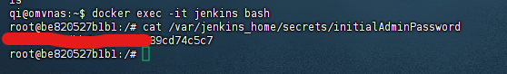

# Docker 安裝 Jenkins
## 簡介
Jenkins 是一款開源的自動化工具，主要用於 持續整合（CI） 和 持續部署（CD）。它支援多種建置工具（如 Maven、Gradle）、版本控制系統（如 Git、SVN），並可透過插件擴展功能，整合 Docker、Kubernetes、Slack 等工具。Jenkins 可運行於 Windows、Linux、Docker 等環境，並採用 Master-Agent 架構 來提高效能與可擴展性。你已經在 Docker 內架設 Jenkins，這有助於環境隔離、版本管理及部署靈活性。 

## 主要學習
1. 安裝Jenkins
2. 拉取Gitea 專案 讓Jenkins整合 (CI)
3. 將Gitea 專案 經由Jenkins測試專案後自動部署Docker (CD)

## 基礎安裝Jenkins
1. 建立資料夾DevOps在創建資料夾Jenkins (DevOps/Jenkins)
2. 再Jenkins資料夾下創建 docker-compose.yml
```
services:
  jenkins:
    image: jenkins/jenkins:lts
    container_name: jenkins
    restart: always
    ports:
      - "8080:8080"
      - "50000:50000"
    volumes:
      - ~/jenkins_home:/var/jenkins_home
      - /var/run/docker.sock:/var/run/docker.sock  # 允許容器訪問主機的 Docker 守護進程
      - /usr/local/bin/docker:/usr/local/bin/docker  # 確保 Docker 客戶端在容器中可用
      - /opt/allure-2.33.0:/opt/allure-2.33.0  # 將宿主機上的 Allure 安裝路徑掛載到容器內
      - /usr/lib/jvm/jdk-21.0.6-oracle-x64:/usr/lib/jvm/jdk-21.0.6-oracle-x64  # 將宿主機的 JDK 路徑掛載到容器內
    environment:
      - JAVA_HOME=/usr/lib/jvm/jdk-21.0.6-oracle-x64  # 設定 JAVA_HOME 環境變數
      - PATH=$JAVA_HOME/bin:$PATH  # 確保容器內可以使用 java 命令
    user: root  # 這裡將 Jenkins 容器運行的用戶設置為 root，方便安裝 Docker 客戶端
    entrypoint: /bin/bash -c "apt-get update && apt-get install -y python3 python3-venv python3-pip && \
                            if ! docker ps > /dev/null; then apt-get install -y docker.io; fi && \
                            exec /usr/local/bin/jenkins.sh"

```
3. 輸入 docker-compose up -d 就安裝完成 (須等PYTHON跟DOCKER CLI 安裝好才會看到畫面)
```
docker-compose up -d
```
4. 訪問 http://localhost:8080/ ，可以看到 Jenkins 已啟動，並顯示需要輸入密碼解鎖。

 進入 Jenkins 容器
```
docker exec -it jenkins bash
```
查詢密碼
```
cat /var/jenkins_home/secrets/initialAdminPassword
```



5. 選擇推薦安裝的
6. 輸入用戶名跟密碼
7. 再來記得都是localhost:8080確定沒問題就可以完成了
8. 下载插件在系统管理—插件管理的Available plugins
```
Locale        （中文插件）

Gitlab Plugin （拉取 gitlab 中的源代码）

Maven Integration（mavene 構建工具）

Publish Over SSH（推送工具）

Role-based Authorization Strategy（權限管理）

Deploy to container（自动化部署工程所需要插件，部署到容器插件）

git parameter（用户參數化構建過程添加git類型參數）

Docker Plugin 

Docker Pipeline

Gitea (3個都安裝)
            
```

9. 安裝Python 與docker CLI 
進入jenkins容器
```
docker exec -it jenkins bash
```

查看python 版本
```
python3 --version
```
或者看所有版本
```
ls /usr/bin/python*

python3 --version
python3.11 --version
python3.9 --version

```
如果你的系統沒有 python 指令，你可以手動建立一個符號連結，讓 python 指向 python3：
```
ln -s /usr/bin/python3 /usr/bin/python

python --version

```
若沒有安裝 安裝Python
```
apt update && apt install -y python3 python3-venv python3-pip
```
然後在執行剛剛上面確認


10. 先確定是否有docker CLI
```
docker ps

```
沒有就要安裝
```
apt-get update
apt-get install -y docker.io

```